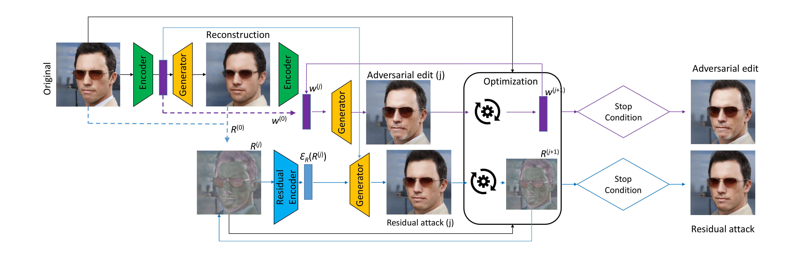

# StyleAdv Official implementation

If you use our work, please cite our paper:

```
@inproceedings{le2024styleadv,
  title={StyleAdv: A Usable Privacy Framework Against Facial Recognition with Adversarial Image Editing},
  author={Le, Minh Ha and Carlsson, Niklas},
  booktitle={Proceedings on Privacy Enhancing Technologies (PoPETs)},
  year={2024}
}
```
**StyleAdv: A Usable Privacy Framework Against Facial Recognition with Adversarial Image Editing**<br>
Minh-Ha Le and Niklas Carlsson <br>

**Abstract:**
In this era of ubiquitous surveillance and online presence, protecting facial privacy has become a critical concern for individuals and society as a whole. Adversarial attacks have emerged as a promising solution to this problem, but current methods are limited in quality or are impractical for sensitive domains such as facial editing.

This paper presents a novel adversarial image editing framework called StyleAdv, which leverages StyleGAN's latent spaces to generate powerful adversarial images, providing an effective tool against facial recognition systems. StyleAdv achieves high success rates by employing meaningful facial editing with StyleGAN while maintaining image quality, addressing a challenge faced by existing methods. To do so, the comprehensive framework integrates semantic editing, adversarial attacks, and face recognition systems, providing a cohesive and robust tool for privacy protection. We also introduce the ``residual attack" strategy, using residual information to enhance attack success rates.  Our evaluation offers insights into effective editing, discussing tradeoffs in latent spaces, optimal edits for our optimizer, and the impact of utilizing residual information.

Our approach is transferable to state-of-the-art facial recognition systems, making it a versatile tool for privacy protection. In addition, we provide a user-friendly interface with multiple editing options to help users create effective adversarial images. Extensive experiments are used to provide insights and demonstrate that StyleAdv outperforms state-of-the-art methods in terms of both attack success rate and image quality. By providing a versatile tool for generating high-quality adversarial samples, StyleAdv can be used both to enhance individual users' privacy and to stimulate advances in adversarial attack and defense research.

## Description



This repository hosts the "StyleAdv" project, directly linked to our research paper on enhancing privacy against facial recognition systems. Our work introduces two key attack strategies: `semantic adversarial editing` and `residual attack`. These strategies are designed to effectively disrupt facial recognition technology by subtle perturbations.

For practical demonstration, we provide a user-friendly demo in two formats: a Google Colab notebook and a local application using Gradio. Both platforms offer an interactive experience, allowing users to experiment with our adversarial editing techniques. The repository is showcasing the effectiveness of StyleAdv in countering facial recognition systems while being accessible to a wide audience.

### Security/Privacy Issues and Ethical Concerns
StyleAdv is designed to protect privacy against facial recognition using image editing. While our intended use case is to help regular people avoid being tracked on social media, we acknowledge that the tool also can be misused, including by criminals trying to hide from law enforcements, for example.  When realizing our tool, we ask users to use the tools responsibly. Regardless of use case, we believe that it is important to give everyone fair access to new technologies such as these and help encourage further technical developments.  By giving easy-to-use access to our tool, we aim to make sure it is accessible to a broad audience, not only those proficient in the underlying techniques.  We believe that everybody’s privacy must be respected, and that everybody should be in control of his or her own images.

## Basic Requirements
- Ubuntu 18.04
- Pytorch 1.7.1
- Cuda Toolkit 11.2.2

### Hardware recommendations
This framework has been successfully tested on:
- CPU: Intel core i7 10th generation
- GPU: Nvidia RTX 3090 (this is not a requirement, any GPU with at least 12GB of VRAM should be enough)
- RAM: 32 GB DDR4

### Software Requirements
- Anaconda/Mini conda
- Latest Nvidia driver

### Estimated Time and Storage Consumption

For the evaluation of adversarial attacks using StyleGAN2, consider these time and storage aspects:

1. **Time for Evaluation:**
   - Generating each adversarial sample typically takes about 10-12 seconds.
   - The total time will depend on how many samples you're creating and other hyper parameters.

2. **Storage Requirements:**
   - Make sure to have at least 5GB of free disk space for the adversarial samples and any temporary data.
   - The exact space needed may vary based on the number and resolution of the images you generate.


## Environment & setups


### Accessibility
Access via GitHub repository:
https://github.com/minha12/StyleAdv.git

### Installations
We recommend to set up the virtual environment by Mini Conda:

```
git clone https://github.com/minha12/StyleAdv.git
cd StyleAdv
conda env update -n styleadv --file ./requirements.yaml
pip install --upgrade --no-cache-dir gdown
wget https://github.com/ninja-build/ninja/releases/download/v1.8.2/ninja-linux.zip
sudo unzip ninja-linux.zip -d /usr/local/bin/
sudo update-alternatives --install /usr/bin/ninja ninja /usr/local/bin/ninja 1 --force
```


### Special requirements for Nvidia RTX 30 series

- Install Cuda Toolkit 11.2.2
- Pytorch 1.7.1:
```
pip install torch==1.7.1+cu110 torchvision==0.8.2+cu110 torchaudio===0.7.2 -f https://download.pytorch.org/whl/torch_stable.html
```

## Demo Instructions for StyleAdv

To facilitate an easy and accessible demonstration of our StyleAdv framework, we offer two distinct options. You can choose the one that best suits your needs and technical comfort:

### Option 1: Google Colab (Recommended for Ease of Use)
Google Colab provides a user-friendly way to experience StyleAdv without the need for local software installations. Follow these steps to get started:

1. **Access the Notebook:** Click on the provided link to open the Jupyter notebook in Google Colab.
2. **Run the Notebook:** Follow the instructions within the notebook to execute the code cells. Google Colab provides an interactive environment, so you can easily run and modify the code.
3. **Explore Gradio App:** Within the Colab notebook, you'll find a built-in Gradio app. This intuitive interface allows you to interact with StyleAdv, test different inputs, and see the results in real-time.
4. **No Installation Needed:** Since everything runs in the cloud, you don't need to install any software on your device.

### Option 2: Run Gradio App Locally
For those who prefer a local setup, running the Gradio app on your machine is an excellent choice. Here’s how to do it:

1. **Clone the Repository & Install Dependencies:** See above.
2. **Run the Gradio App:** Navigate to the directory containing the Gradio app script and run `demo.py` using Python. This will start a local server, and the Gradio interface will be accessible through your web browser.
3. **Local Interaction:** Experiment with the Gradio app locally, providing inputs and observing the outputs directly on your machine.
